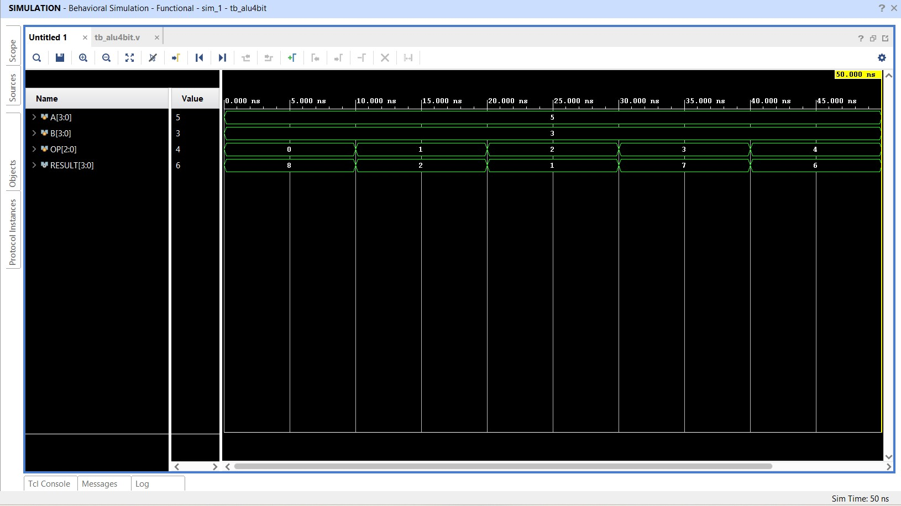
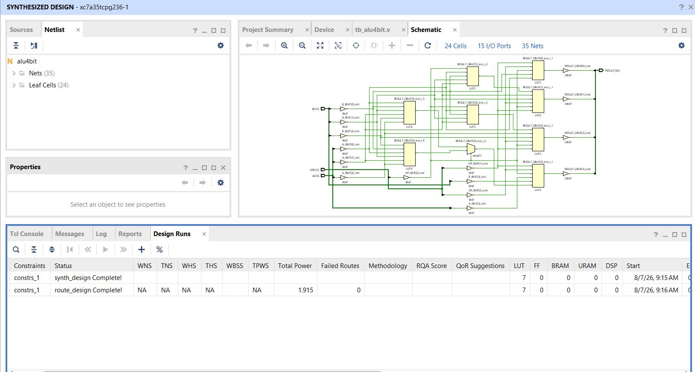
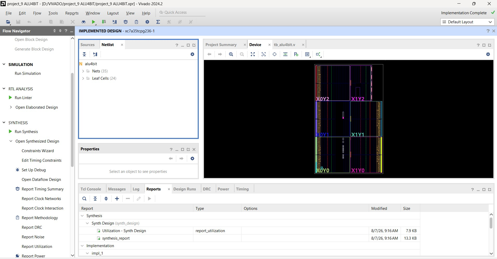
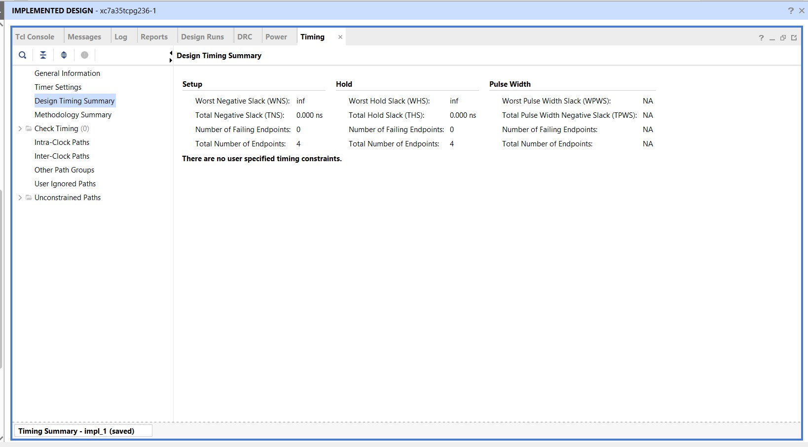
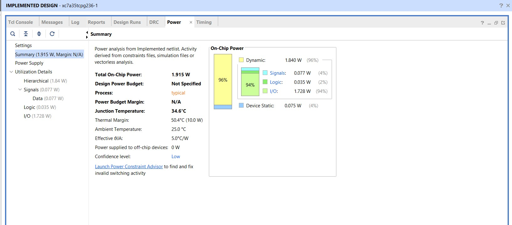

# 4-Bit ALU using Verilog HDL

## Objective
Design and verify a 4-bit Arithmetic Logic Unit using Verilog HDL in Xilinx Vivado.

## Operations
- Addition
- Subtraction
- AND
- OR
- XOR

## Tools
- Verilog HDL
- Vivado 2024.2

## Files
- alu4bit.v
- tb_alu4bit.v

## Results
- Behavioral Simulation
- Synthesis
- Implementation
- Timing Analysis
- Power Report
  ## Simulation Waveform

## Synthesis

## Implementation

## Timing Report

## Power Report

